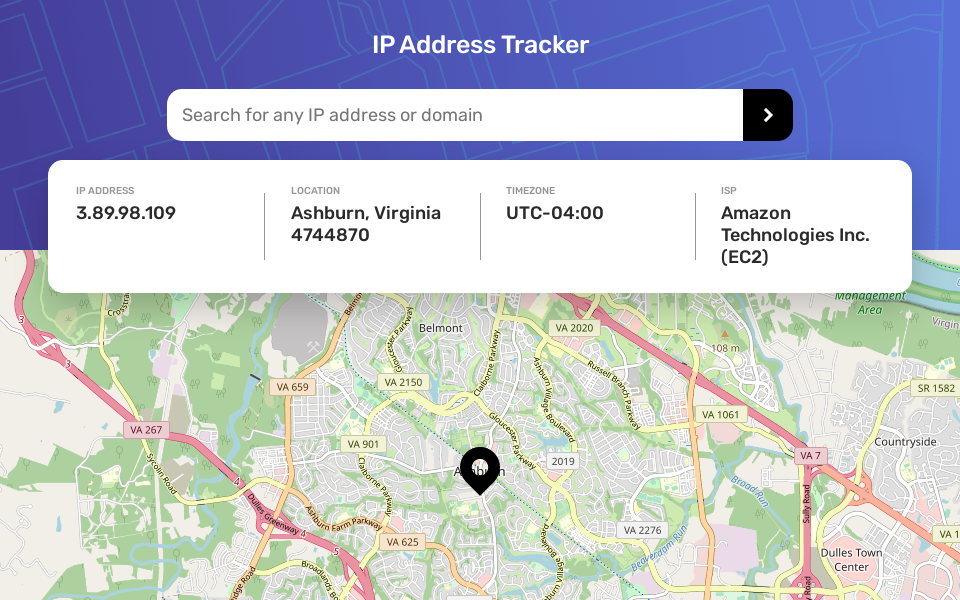

# Frontend Mentor - IP address tracker solution

This is a solution to the [IP address tracker challenge on Frontend Mentor](https://www.frontendmentor.io/challenges/ip-address-tracker-I8-0yYAH0). Frontend Mentor challenges help you improve your coding skills by building realistic projects.

## Table of contents

- [Overview](#overview)
  - [The challenge](#the-challenge)
  - [Screenshot](#screenshot)
  - [Links](#links)
- [How to use](#how-to-use)
- [Built with](#built-with)
- [Useful resources](#useful-resources)
- [Author](#author)

## Overview

### The challenge

Users should be able to:

- View the optimal layout for each page depending on their device's screen size
- See hover states for all interactive elements on the page
- See their own IP address on the map on the initial page load
- Search for any IP addresses or domains and see the key information and location

### Screenshot



### Links

- [Solution URL](https://www.frontendmentor.io/solutions/ip-address-tracker-react-and-sass-dCTT2YpP5)
- [Live Site URL](https://ip-address-tracker-b.netlify.app/)

## How To Use

To clone and run this application, you'll need [Git](https://git-scm.com) and [Node.js](https://nodejs.org/en/download/) installed on your computer. From your command line:

```bash
# Clone this repository
$ git clone https://github.com/BrandonSdvl/IP-address-tracker.git

# Install dependencies
$ npm install

# Run server
$ npm start
```

## Built with

- [React](https://reactjs.org/) - JS library
- [Sass](https://sass-lang.com/) - CSS Preprocessor
- [Ipify](https://www.ipify.org/) - IP Address API
- [Leaflet](https://leafletjs.com/) - Maps library
- [React Leaflet](https://react-leaflet.js.org/) - React components for Leaflet maps

## Useful resources

- [Loading.io](https://loading.io/) - This page offers loaders in css and js that you can easily include in your projects
- [React Leaflet tutorial](https://www.youtube.com/watch?v=62Y8SFi2wBk) - This tutorial explains how to use react leaflet in an easy way

## Author

- Frontend Mentor - [@BrandonSdvl](https://www.frontendmentor.io/profile/BrandonSdvl)
- Github - [@BrandonSdvl](https://github.com/BrandonSdvl)
